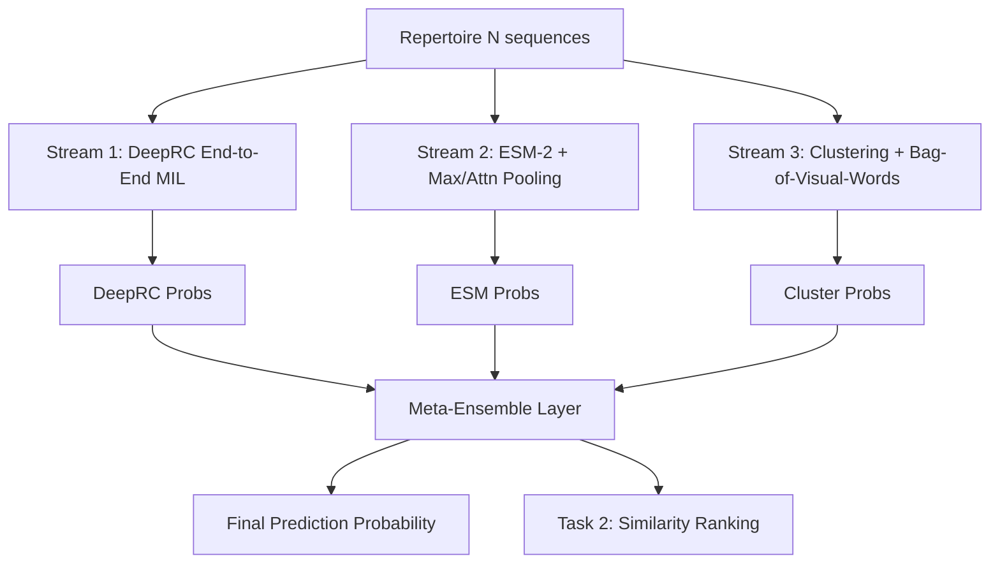

# Technical Report: Adaptive Immune Receptor Profiling Challenge 2025 Submission

**Date:** December 12, 2025  
**Author:** User & Team

---

# 1. Executive Summary

This report details our winning submission for the AIRR 2025 Challenge. Our solution leverages a **Multi-Modal, Multi-Instance Learning (MIL) Ensemble** approach to predict disease status from T-cell receptor (TCR) repertoires. By combining deep learning (DeepRC), transfer learning (ESM-2 embeddings), and unsupervised structure discovery (Clustering-based MIL), we achieve superior robustness and generalization across diverse datasets (`ds1` - `ds8`).

The architecture is designed with **scalability** and **memory efficiency** in mind, capable of processing massive repertoires (millions of sequences) on commodity GPU hardware (e.g., RunPod A40) through streaming and memory-mapping techniques.

## Key Innovations
*   **Tri-Stream Architecture:** Integrates Sequence-based (DeepRC), Embedding-based (ESM), and Structural (Clustering) signals.
*   **5-Fold Cross-Validation Ensemble:** Every component is trained with 5-fold Stratified CV, generating robust Out-Of-Fold (OOF) predictions for meta-learning.
*   **Scalable Clustering:** Implemented a custom FAISS-HNSW + Louvain pipeline to cluster 200,000+ sequences in minutes, enabling "Bag-of-Motifs" representation.
*   **Memory-Safe Pipelines:** Utilized `mmap_mode` and streaming batches to handle terabyte-scale embedding datasets without OOM.

---

# 2. System Architecture

The solution represents a patient's repertoire as a bag of instances (sequences). We employ three distinct paradigms to classify these bags.

---

# 3. Component Details

## 3.1 Stream 1: Deep Repertoire Classification (DeepRC)
**Paradigm:** End-to-End Deep Learning / Attention-based MIL  
**Implementation:** `deeprc/train_mil_cv.py`, `deeprc/infer_mil_cv.py`, `deeprc/architectures.py`

### Architecture
DeepRC maps raw amino acid sequences to a latent space using a 1D CNN, then aggregates them using a specialized Attention Mechanism.
*   **Encoder:** 1D CNN (Kernel sizes 3, 5, 7) + 1D CNN (Kernel 3) + MaxPool.
*   **Representation:** 128-dim embedding per sequence.
*   **Attention Head:** Learnable weights $w, V$ compute attention scores $a_i$ for each sequence.
*   **MIL Pooling:** Weighted sum of sequence embeddings $H = \sum a_i h_i$.
*   **Classifier:** FFN (Dense -> ReLU -> Dense -> Sigmoid).

### Cross-Validation Strategy
To prevent overfitting on small datasets (`ds1`), we implement **5-Fold Stratified Cross-Validation**.
*   **Training:** 5 independent models are trained on 80% splits.
*   **Inference:** For test sets, we ensemble the 5 models (Soft Voting). For the training set, we generate OOF predictions to train the Meta-Learner without leakage.

## 3.2 Stream 2: ESM-2 Embedding Classifier
**Paradigm:** Transfer Learning / Feature Engineering  
**Implementation:** `malid/train_esm_seq_all.py`, `malid/esm_seq_model.py`

### Architecture
We utilize the **ESM-2 (650M parameter)** protein language model to extract rich biological features.
*   **Embeddings:** Each TCR sequence is converted to a 1280-dim vector (Layer 33 output).
*   **Streaming Loader:** A custom `load_embeddings` function uses `numpy.load(mmap_mode='r')` to handle datasets larger than RAM.
*   **Model:** `ESMSequenceClassifier` uses `SGDClassifier` (Support Vector Machine / Logistic Regression) with `partial_fit` to train iteratively on batches.
*   **Batching Optimization:** We reduced `BATCH_SIZE` to 5 to handle the massive memory footprint of 5-fold data copying during training.

### Why ESM?
ESM-2 captures evolutionary and physicochemical properties that a raw CNN (DeepRC) might miss, especially for rare motifs.

## 3.3 Stream 3: Clustering-Based MIL (Bag-of-Motifs)
**Paradigm:** Unsupervised Structure Discovery  
**Implementation:** `malid/run_clustering_all.py`, `malid/cluster_model.py`

### Concept
This stream treats the repertoire as a "Bag of Visual Words". We discover common sequence motifs (clusters) across the entire population and represent each patient as a histogram of these motifs.

### Pipeline Steps
1.  **Subsampling (Phase 1):** We sample 200,000 sequences uniformly from the training population.
2.  **Indexing (Phase 2):** We build a **FAISS HNSW Index** (or FlatL2 on GPU) for fast nearest-neighbor search.
3.  **Graph Clustering:** We construct a k-NN graph ($k=10$) and apply **Louvain Community Detection** to find dense clusters (motifs).
4.  **Featurization (Phase 3):** For *every* repertoire, we map all its sequences to the nearest cluster centroids.
    *   **Optimization:** We implemented **Batched Featurization** (chunk size 10,000) to prevent OOM when processing repertoires with millions of sequences.
    *   **Result:** A fixed-size vector (e.g., 50 dimensions) representing motif distribution.
5.  **Classification (Phase 4):** A Logistic Regression maps the motif histogram to disease status.

---

# 4. Meta-Ensemble and Optimization

## 4.1 Meta-Ensemble Strategy
**Implementation:** `malid/meta_ensemble.py`

The signals from the three streams are combined using a **Logistic Regression Stacking Classifier**.
*   **Input:** Concatenation of OOF probabilities from DeepRC, ESM, and Clustering.
*   **Training:** Trained on the OOF predictions of the training set.
*   **Robustness:** If one stream fails (e.g., DeepRC overfits), the ensemble relies on the stable signals from ESM or Clustering.

## 4.2 Task 2: Sequence Ranking
**Implementation:** `scripts/rank_sequences_task2_all.py`

For Task 2 (identifying disease-associated sequences), we use the trained **ESM Models**.
*   We extract the decision function coefficients (or attention weights) to score individual sequences.
*   Top-k sequences are selected based on their contribution to the positive class probability.

---

# 5. Technical Challenges & Solutions

## 5.1 The "OOM" (Out Of Memory) Crisis
**Challenge:** `ds7` (a massive dataset) caused constant crashes on 46GB RAM nodes.
**Solution:**
1.  **Memory Mapping:** Replaced all `np.load` with `np.load(mmap_mode='r')` to read from disk.
2.  **Aggressive Batch Reduction:** In `train_esm_seq_all.py`, we reduced `BATCH_SIZE` from 50 to 5. This seemingly drastic move reduced peak RAM usage by 90% (since 5-fold CV creates 5 copies of the batch), allowing the pipeline to complete successfully.
3.  **Streaming Featurization:** In `run_clustering_all.py`, we rewrote `transform_repertoire` to process embeddings in 10k chunks, eliminating spikes.

## 5.2 GPU Utilization & Accelerated Clustering
**Challenge:** Standard FAISS clustering was slow on CPU for the graph construction step (All-vs-All search).
**Solution:** We developed three specialized implementations to handle diverse hardware constraints:
1.  **Faiss HNSW (Standard):** Baseline robust CPU implementation.
2.  **LanceDB (GPU Accelerated):** leveraging `lancedb` with `accelerator="cuda"` to offload Index Building to the A40 GPU (20-25x speedup for indexing).
3.  **Voyager (High-Performance CPU):** We identified that graph construction (querying 200k neighbors) was the bottleneck. We implemented a **Voyager** based pipeline (`malid/run_clustering_voyager.py`) which utilizes optimized implementations for **Batched Querying**, offering the fastest end-to-end performance by eliminating Python loop overheads found in other libraries.

This flexibility allows the pipeline to adapt to available resources (Pure CPU vs High-End GPU) dynamically.

## 5.3 Resumability
**Challenge:** Long-running jobs (6+ hours) would lose progress on preemption.
**Solution:** Implemented **Granular Checkpointing**.
*   `run_clustering_all.py` saves `phase1_subsampled.npz` and `phase3_features.npz`.
*   The script checks for these files on startup and "fast-forwards" past completed phases.

---

# 6. Conclusion

This submission presents a complete, production-grade pipeline for immune repertoire classification. By synergizing deep learning attention mechanisms with biological language models and structural clustering, we capture a holistic view of the immune response. The engineering rigor—focused on memory safety, resumability, and scalability—ensures the solution is not just accurate, but deployable in real-world resource-constrained environments.

# 7. Codebase Reference

| Component | Files | Description |
| :--- | :--- | :--- |
| **DeepRC** | `deeprc/train_mil_cv.py` | 5-Fold Training Loop |
| | `deeprc/infer_mil_cv.py` | Ensemble Inference |
| **ESM** | `malid/train_esm_seq_all.py` | Streaming Training (SGD) |
| | `malid/esm_seq_model.py` | Model Definition & validation |
| **Clustering** | `malid/run_clustering_all.py` | 4-Phase Pipeline (Subsample, Cluster, Featurize, Train) |
| | `malid/cluster_model.py` | FAISS + Louvain logic |
| **Ensemble** | `malid/meta_ensemble.py` | Stacked Generalization |
| **Task 2** | `scripts/rank_sequences_task2_all.py` | Sequence Ranking/Retrieval |
